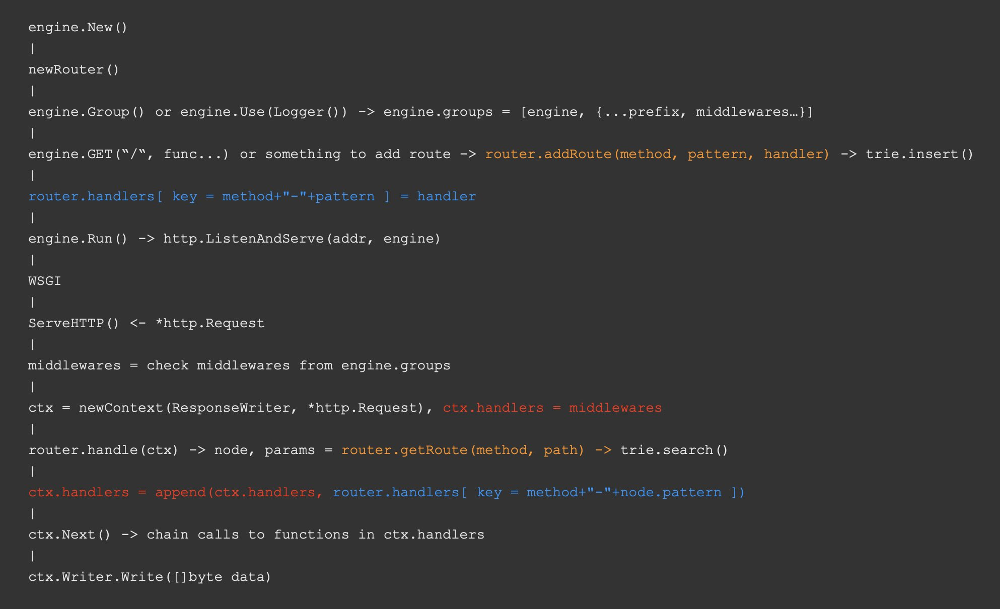

# Go-EngineT

A tiny web framework inspired by Gin.

## Demo

```go
r := enginet.Default()
r.GET("/", func(ctx *enginet.Context) {
    ctx.String(http.StatusOK, "奥利给")
})
r.GET("/hello/:name", func(ctx *enginet.Context) {
    ctx.JSON(http.StatusOK, enginet.H{
        "name": ctx.Param("name"),
    })
})
api := r.Group("/api")
{
    api.GET("/", func(ctx *enginet.Context) {
        ctx.HTML(http.StatusOK, "<h1>Hello API</h1>")
    })
}
r.GET("/panic", func(ctx *enginet.Context) {
    panic("panic")
})
log.Fatal(r.Run(conf.Host + ":" + conf.Port))
```

## Pipeline


